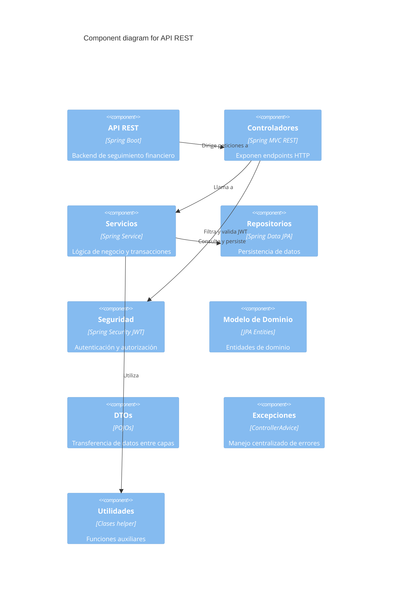

# Arquitectura general y capas del sistema

La aplicación **Finance Tracker** está organizada en una arquitectura por capas que facilita la separación de responsabilidades, la mantenibilidad y la escalabilidad. Cada capa agrupa componentes con funciones específicas, desde la exposición de endpoints REST hasta la persistencia de datos y utilidades transversales.

## Estructura de paquetes

A continuación se muestra la estructura de paquetes bajo

`src/main/java/com/finance/tracker`:

| Paquete | Capa | Responsabilidad | Emoji |
| --- | --- | --- | --- |
| ------------------------------------- | ------------------ | -------------------------------------------------------------- | :-----: |
| `controller` | Presentación | Define REST controllers y mapea rutas HTTP | 🎛️ |
| `domain` | Dominio | Entidades JPA que reflejan tablas de la base de datos | 🗄️ |
| `dto` | Transferencia | Data Transfer Objects para comunicar datos entre capas | 📦 |
| `exception` | Manejo de errores | Clases de excepción y controlador global de errores | 🚨 |
| `repository` | Persistencia | Interfaces Spring Data JPA para CRUD sobre entidades | 💾 |
| `security` | Seguridad | Configuración de Spring Security y filtros JWT | 🛡️ |
| `service` | Lógica de negocio | Implementaciones de reglas de negocio y transacciones | 🔄 |
| `utility` | Utilidades | Funciones auxiliares y constantes globales | ⚙️ |


```bash
src/main/java/com/finance/tracker
├── controller      # REST Controllers
├── domain          # Entidades JPA
├── dto             # Data Transfer Objects  
├── exception       # Excepciones y handler  
├── repository      # Repositorios JPA  
├── security        # JWT y configuración de seguridad  
├── service         # Servicios de negocio  
└── utility         # Constantes y utilidades  
```

Esta organización sigue el patrón multicapa clásico, donde los controladores reciben peticiones HTTP y delegan en los servicios, que a su vez interactúan con los repositorios para acceder a la base de datos mientras usan DTOs y arrojando excepciones gestionadas globalmente .

---

## Correspondencia con capas lógicas



> Los componentes reflejan los subpaquetes de `com.finance.tracker` y sus responsabilidades respectivas.

---

## Recursos en `src/main/resources`

La carpeta de recursos agrupa propiedades de configuración, banners y archivos de ORM:

| Archivo | Propósito | Ejemplo de configuración |
| --- | --- | --- |
| `application.properties` | Configuración base y perfil activo | `spring.profiles.active=dev` |
| `application-dev.properties` | Propiedades de desarrollo | DataSource, JPA dialect, logging |
| `application-prod.properties` | Configuración para producción | Conexión a PostgreSQL local, logging |
| `application-test.properties` | Parámetros para entorno de pruebas | Similar a prod, pero para test |
| `banner.txt` | Arte ASCII mostrado al arrancar la aplicación | Banner personalizado |
| `META-INF/orm.xml` | Mapeos y configuraciones JPA adicionales | Incluido en el JAR |


```bash
src/main/resources
├── application.properties
├── application-dev.properties
├── application-prod.properties
├── application-test.properties
├── banner.txt
└── META-INF/orm.xml
```

---

## Pruebas en `src/test/java`

Sólo existe un test de arranque que verifica el contexto de Spring Boot:

```bash
src/test/java/com/finance/tracker
└── FinanceTrackerApplicationTests.java  # Test de integración básica
```

Este test se ejecuta con Spring Boot Starter Test y asegura que la aplicación arranca sin errores.

---

## Notas clave

- **Separación de responsabilidades**: Cada paquete se encarga de un aspecto concreto según su capa.
- **Spring Data JPA**: Maneja el acceso a datos a través de repositorios (`repository`).
- **Spring Security + JWT**: El paquete `security` define filtros y constantes para proteger rutas.
- **Externalización de configuración**: Distintos perfiles facilitan despliegues en Docker o JAR.
- **Modularidad**: La estructura limpia simplifica el mantenimiento y la adición de nuevas funcionalidades.

```card
{
    "title": "Buen dise\u00f1o multicapa",
    "content": "La separaci\u00f3n entre controller, service y repository promueve la claridad y testabilidad."
}
```