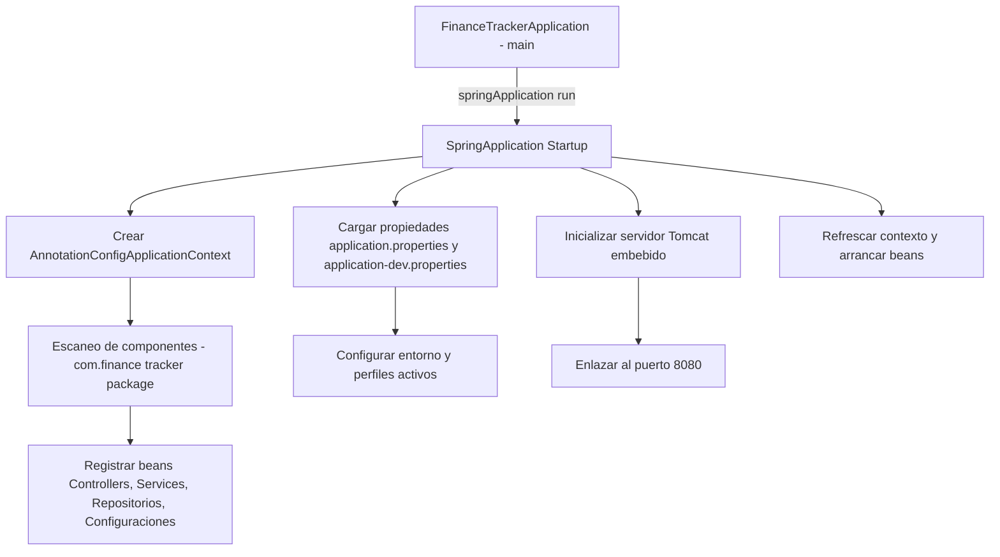

# Arquitectura general y capas del sistema

En esta sección describimos el **modelo de ejecución Spring Boot** que sustenta Finance Tracker. Veremos cómo la clase de entrada inicia el contexto de Spring, realiza el escaneo de componentes, aplica configuraciones por perfiles y arranca el servidor embebido en el puerto 8080.

## Modelo de ejecución Spring Boot

Spring Boot simplifica el arranque y la configuración de la aplicación. Al ejecutar `SpringApplication.run(...)`, se crea un contexto basado en anotaciones, se auto-configuran beans y se lanza el servidor HTTP integrado.

### Clase de entrada: FinanceTrackerApplication 🚀

Esta es la clase principal que inicia toda la aplicación.

```java
package com.finance.tracker;

import org.springframework.boot.SpringApplication;
import org.springframework.boot.autoconfigure.SpringBootApplication;

@SpringBootApplication
public class FinanceTrackerApplication {
    public static void main(String[] args) {
        SpringApplication.run(FinanceTrackerApplication.class, args);
    }
}
```

- **@SpringBootApplication** combina:
- @Configuration: define clases de configuración.
- @EnableAutoConfiguration: aplica configuración automática según dependencias.
- @ComponentScan: busca beans en el paquete `com.finance.tracker`.
- El método **main** invoca `SpringApplication.run`, arranca el contexto y el servidor HTTP.

```card
{
    "title": "Punto de entrada",
    "content": "FinanceTrackerApplication inicia el contexto de Spring Boot y el servidor embebido."
}
```

### Secuencia de arranque

A continuación, el flujo de inicio resumido:



1. **SpringApplication Startup**: inicializa el entorno y el `ApplicationContext`.
2. **Component Scan**: detecta clases anotadas (`@RestController`, `@Service`, etc.).
3. **Auto-configuration**: configura JPA, seguridad, validación y servidor embebido.
4. **Context Refresh**: finaliza el arranque y deja la aplicación operativa.

### Integración de configuraciones y perfiles

Spring Boot soporta múltiples entornos mediante perfiles. El archivo principal activa el perfil `dev`:

```properties
# src/main/resources/application.properties
spring.application.name=finance-tracker
spring.profiles.active=dev
```

A continuación, los archivos de configuración por entorno:

| Archivo | Propósito |
| --- | --- |
| application.properties | Activa perfil **dev** |
| application-dev.properties | Configuración de **desarrollo** (BD, JPA) |
| application-test.properties | Configuración para **pruebas** |
| application-prod.properties | Parámetros de **producción** |


application-dev.properties muestra la conexión a PostgreSQL, JPA y el puerto del servidor:

```properties
# target/classes/application-dev.properties
spring.datasource.url=jdbc:postgresql://.../finance_tracker
spring.datasource.username=avnadmin
spring.datasource.password=AVNS_BmD3-uGWeOpfxpxn761
spring.jpa.hibernate.ddl-auto=update
spring.jpa.show-sql=true
server.port=8080
```

### Servidor embebido

Spring Boot arranca un contenedor Tomcat por defecto.

- **Puerto**: se configura en `server.port`, por defecto 8080.
- **Auto-configuración**: no requiere `web.xml`; detecta `spring-boot-starter-web`.
- **Arranque**: tras cargar beans, Tomcat inicia y queda a la espera de peticiones HTTP.

---

Con este modelo de ejecución, Finance Tracker:

- Unifica configuración por perfiles.
- Escanea automáticamente las **capas** (`controller`, `service`, `repository`, etc.).
- Ofrece un arranque simplificado y un servidor integrado listo en **8080**.