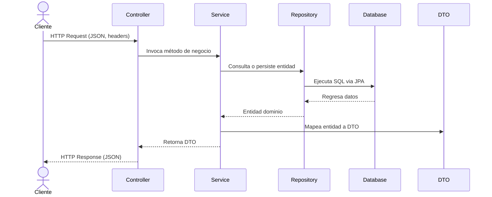

# Arquitectura general y capas del sistema

Esta sección ofrece una **visión completa** de la arquitectura por capas de la aplicación de seguimiento financiero. Se describen las ocho capas principales, sus responsabilidades y cómo interactúan para exponer una API REST robusta, modular y mantenible.

## Visión general de la arquitectura por capas

La aplicación sigue el patrón de **arquitectura por capas**, donde cada capa tiene una responsabilidad clara y aislada. Esto facilita:

- La separación de preocupaciones.
- La reutilización y prueba de componentes.
- La escalabilidad y mantenibilidad del código.

A continuación se muestra la lista de capas y su propósito principal :

| Capa | Paquete | Responsabilidad |
| --- | --- | --- |
| 🎯 Controlador | com.finance.tracker.controller | Maneja las peticiones HTTP y define endpoints REST. |
| 🏛️ Dominio | com.finance.tracker.domain | Contiene las entidades JPA que representan las tablas de la base de datos. |
| 🔄 DTO | com.finance.tracker.dto | Objetos de transferencia de datos entre capas; protegen las entidades de dominio. |
| ⚠️ Excepciones | com.finance.tracker.exception | Gestión centralizada de errores y excepciones personalizadas. |
| 💾 Repositorio | com.finance.tracker.repository | Acceso a datos; usa Spring Data JPA para CRUD sobre entidades. |
| 🔒 Seguridad | com.finance.tracker.security | Configuración de autenticación JWT y autorización de rutas. |
| 💼 Servicio | com.finance.tracker.service | Lógica de negocio; orquesta controladores y repositorios. |
| 🛠️ Utilidades | com.finance.tracker.utility | Clases auxiliares y constantes compartidas entre capas. |


## Estructura de carpetas

```bash
src/
 └─ main/
     ├─ java/
     │   └─ com/finance/tracker/
     │       ├─ controller/
     │       ├─ domain/
     │       ├─ dto/
     │       ├─ exception/
     │       ├─ repository/
     │       ├─ security/
     │       ├─ service/
     │       └─ utility/
     └─ resources/
```

Fuente: estructura del README

---

## Detalle de cada capa

### 1. Capa de Controlador

Esta capa define los **puntos de entrada** de la API REST.

Responsabilidades principales:

- Mapear rutas HTTP a métodos Java.
- Validar parámetros de entrada.
- Llamar a servicios y devolver respuestas HTTP.

Ejemplo de controladores disponibles :

```bash
src/main/java/com/finance/tracker/controller/
  AuthRestController.java
  CategoryRestController.java
  TransactionRestController.java
  TransactionTypeRestController.java
  UserRestController.java
```

### 2. Capa de Dominio

Aquí residen las **entidades JPA** que reflejan el esquema de la base de datos.

Responsabilidades:

- Modelar tablas en clases Java.
- Definir relaciones (@OneToMany, @ManyToOne).
- Encapsular lógica mínima asociada a los datos.

Ejemplo de clase de dominio :

```java
@Entity
@Table(name="users")
@Data
@AllArgsConstructor
@NoArgsConstructor
public class User implements Serializable {
    @Id
    @GeneratedValue(strategy = GenerationType.IDENTITY)
    @Column(name="user_id")
    private Integer userId;
    private String username;
    private String email;
    private String password;
    // Relaciones y auditoría omitidas
}
```

### 3. Capa de DTO

Los **Data Transfer Objects** permiten intercambiar datos entre capas sin exponer entidades:

- Simplifican la serialización JSON.
- Evitan acoplar el dominio con la capa de presentación.

DTO disponibles :

```bash
src/main/java/com/finance/tracker/dto/
  CategoryDTO.java
  TransactionDTO.java
  TransactionTypeDTO.java
  UserDTO.java
```

### 4. Capa de Excepciones

Gestión centralizada de errores y respuestas HTTP amigables:

- `NotFoundException` para recursos inexistentes.
- `ErrorMessage` define el payload de error.
- `RestResponseEntityExceptionHandler` captura excepciones y formatea la respuesta.

Clases clave :

```bash
com.finance.tracker.exception
 ├─ ErrorMessage.java
 ├─ NotFoundException.java
 └─ RestResponseEntityExceptionHandler.java
```

### 5. Capa de Repositorio

Define las interfaces que extienden **JpaRepository** para cada entidad:

- Operaciones CRUD automáticas.
- Consultas personalizadas mediante métodos de firma.

Ejemplo :

```bash
com.finance.tracker.repository
 ├─ UserRepository.java
 ├─ CategoryRepository.java
 ├─ TransactionRepository.java
 └─ TransactionTypeRepository.java
```

### 6. Capa de Seguridad

Implementa **JWT** y configura permisos:

- `CustomWebSecurity` extiende WebSecurityConfigurerAdapter.
- `CustomJWTAuthorizationFilter` valida tokens en cada petición.
- `CustomSecurityConstants` almacena secretos y rutas públicas.

Clases de seguridad :

```bash
com.finance.tracker.security
 ├─ CustomSecurityConstants.java
 ├─ CustomWebSecurity.java
 └─ CustomJWTAuthorizationFilter.java
```

### 7. Capa de Servicio

Orquesta la lógica de negocio entre controladores y repositorios:

- Interfaces (`UserService`, `AuthService`, etc.).
- Implementaciones (`UserServiceImpl`, `AuthServiceImpl`, etc.).

Listado de servicios :

```bash
com.finance.tracker.service
 ├─ AuthService.java
 ├─ AuthServiceImpl.java
 ├─ UserService.java
 ├─ UserServiceImpl.java
 └─ (otros servicios similares)
```

### 8. Capa de Utilidades

Funciones y constantes **reutilizables**:

- `Constants`: valores estáticos globales.
- `CustomPasswordGenerator`: generación de contraseñas seguras.
- `Utilities`: métodos estáticos de validación/mapeo.

Ubicación :

```bash
com.finance.tracker.utility
 ├─ Constants.java
 ├─ CustomPasswordGenerator.java
 └─ Utilities.java
```

---

## Flujo típico de una petición



Este diagrama ilustra cómo, desde el controlador hasta la base de datos y de vuelta, cada capa juega un papel claro, garantizando una separación de preocupaciones y un ciclo de vida de petición ordenado.