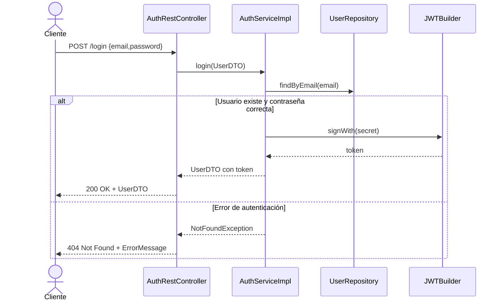

# Capa de Controladores REST

La **Capa de Controladores REST** expone los endpoints HTTP y actúa como puerta de entrada a la lógica de negocio. Gestiona solicitudes y respuestas JSON, delegando la autenticación, validación y procesamiento a los servicios correspondientes.

---

## Controlador de Autenticación (AuthRestController)

Este controlador expone el endpoint de **login**, recibiendo credenciales de usuario y devolviendo un token JWT tras validarlas.

```java
package com.finance.tracker.controller;

@RestController
@RequestMapping("/api/v1/auth")
public class AuthRestController {

    @Autowired
    private AuthService authService;

    @RequestMapping("/login")
    public ResponseEntity<?> login(@RequestBody UserDTO userDTO) 
            throws NotFoundException {
        return ResponseEntity.ok()
            .body(authService.login(userDTO));
    }
}
```

*Clase principal que gestiona la autenticación de usuarios.*

---

## Endpoint de Login 🔐

### POST /api/v1/auth/login

```api
{
    "title": "Login de usuario",
    "description": "Autentica al usuario y genera un token JWT",
    "method": "POST",
    "baseUrl": "https://api.example.com",
    "endpoint": "/api/v1/auth/login",
    "headers": [
        {
            "key": "Content-Type",
            "value": "application/json",
            "required": true
        }
    ],
    "queryParams": [],
    "pathParams": [],
    "bodyType": "json",
    "requestBody": "{\n  \"email\": \"user@example.com\",\n  \"password\": \"miPassword\"\n}",
    "formData": [],
    "rawBody": "",
    "responses": {
        "200": {
            "description": "Credenciales v\u00e1lidas",
            "body": "{\n  \"userId\": 1,\n  \"email\": \"user@example.com\",\n  \"username\": \"usuario\",\n  \"token\": \"<jwt_token>\",\n  \"status\": \"A\"\n}"
        },
        "404": {
            "description": "Credenciales incorrectas",
            "body": "{\n  \"status\": 404,\n  \"message\": \"El email o la password son incorrectas.\"\n}"
        }
    }
}
```

---

## Flujo Típico de Autenticación



---

## Dependencias Clave

| Clase | Rol |
| --- | --- |
| **AuthRestController** | Expone `/login` y delega a **AuthService** |
| **AuthServiceImpl** | Valida credenciales, genera JWT |
| **UserDTO** | Transporte de datos de usuario y token |
| **CustomSecurityConstants** | Define `LOGIN_URL`, clave y expiración |
| **UserRepository** | Consulta de usuarios en base de datos |


---

## Detalles del Servicio de Autenticación

```java
@Service
@Slf4j
public class AuthServiceImpl implements AuthService {

    @Autowired
    UserRepository userRepository;

    @Override
    @Transactional(readOnly = true)
    public UserDTO login(UserDTO userDTO) throws NotFoundException {
        log.info("login()");
        // Validaciones básicas
        if (userDTO == null) 
            throw new NotFoundException("null userDTO");
        if (isBlank(userDTO.getEmail())) 
            throw new NotFoundException("El email es requerido.");
        if (isBlank(userDTO.getPassword())) 
            throw new NotFoundException("La password es requerida.");

        // Búsqueda de usuario
        User userEntity = userRepository
            .findByEmail(userDTO.getEmail())
            .orElseThrow(() -> new NotFoundException("El email o la password son incorrectas."));

        // Hash de password y verificación
        String hash = CustomPasswordGenerator
            .hashPassword(userDTO.getPassword())
            .orElseThrow(() -> new NotFoundException("Error al generar hash."));
        if (!userEntity.getPassword().equals(hash)) 
            throw new NotFoundException("La password es incorrecta.");

        // Generación de JWT
        SecretKey key = Keys.hmacShaKeyFor(
            Decoders.BASE64.decode(CustomSecurityConstants.SUPER_SECRET_KEY));
        String token = Jwts.builder()
            .setIssuedAt(new Date())
            .setIssuer(CustomSecurityConstants.ISSUER_INFO)
            .setSubject(userDTO.getEmail())
            .setExpiration(new Date(System.currentTimeMillis()
                + CustomSecurityConstants.TOKEN_EXPIRATION_TIME))
            .signWith(key)
            .compact();

        // Construcción de respuesta
        userDTO.setUserId(userEntity.getUserId());
        userDTO.setUsername(userEntity.getUsername());
        userDTO.setEmail(userEntity.getEmail());
        userDTO.setPassword(hash);
        userDTO.setToken(token);
        userDTO.setStatus(userEntity.getStatus());
        return userDTO;
    }

    private boolean isBlank(String s) {
        return s == null || s.isBlank();
    }
}
```

*Servicio singleton que centraliza la lógica de autenticación y creación de JWT.*

---

## Nota Importante 💡

```card
{
    "title": "Seguridad JWT",
    "content": "El token JWT se firma con clave sim\u00e9trica y expira en 10 d\u00edas."
}
```

Este controlador juega un rol crítico al proteger los recursos de la API, permitiendo el acceso solo a clientes con token válido.