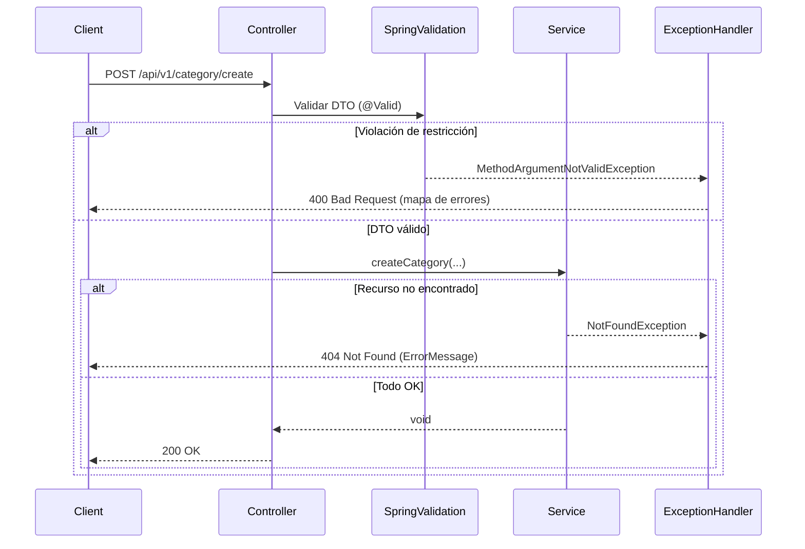

# Capa de Controladores REST – Validación y Gestión de Errores desde Controladores

La **capa de controladores REST** expone los endpoints HTTP de la aplicación. Su responsabilidad principal es:

- Convertir peticiones HTTP en llamadas a los **servicios**.
- Aplicar validaciones de entrada (Bean Validation).
- Delegar la gestión de errores al mecanismo centralizado de Spring.

A continuación se detalla cómo funciona la validación y el manejo de errores.

## Validación de Parámetros con @Valid

Spring Boot integra el soporte de JSR-380 (Bean Validation) a través de `spring-boot-starter-validation`. Cuando decoramos un parámetro de método con `@Valid`, Spring:

1. Deserializa el cuerpo de la petición en el DTO.
2. Aplica las **restricciones** definidas sobre sus campos (por ejemplo, `@NotNull`, `@Size`).
3. Si hay violaciones, lanza `MethodArgumentNotValidException`.

```java
@PostMapping("/create")
public ResponseEntity<?> createCategory(
    @Valid @RequestBody CategoryDTO categoryDTO) throws NotFoundException {
    String user = Utilities.getAuthenticatedUser();
    categoryService.createCategory(categoryDTO, user);
    return ResponseEntity.ok().build();
}
```

- **@Valid**: activa la validación.
- **@RequestBody**: vincula el JSON al DTO.

(Nota: en el código actual, los DTO no incluyen restricciones, pero el patrón permite añadirlas sin cambiar el controlador.)

## Manejo Centralizado de Excepciones

La clase `RestResponseEntityExceptionHandler` procesa todas las excepciones relevantes para producir respuestas JSON coherentes.

```java
@ControllerAdvice
public class RestResponseEntityExceptionHandler
       extends ResponseEntityExceptionHandler {

    // Maneja excepciones de entidad no encontrada
    @ExceptionHandler(NotFoundException.class)
    @ResponseStatus(HttpStatus.NOT_FOUND)
    public ResponseEntity<ErrorMessage> localNotFoundException(
            NotFoundException ex) {
        ErrorMessage msg = new ErrorMessage(
            HttpStatus.NOT_FOUND, ex.getMessage());
        return ResponseEntity
            .status(HttpStatus.NOT_FOUND)
            .body(msg);
    }

    // Captura errores de validación de @Valid
    @Override
    protected ResponseEntity<Object> handleMethodArgumentNotValid(
            MethodArgumentNotValidException ex,
            HttpHeaders headers,
            HttpStatusCode status,
            WebRequest request) {

        Map<String, String> errors = new HashMap<>();
        ex.getBindingResult()
          .getFieldErrors()
          .forEach(err ->
               errors.put(err.getField(), err.getDefaultMessage()));

        return ResponseEntity
            .status(HttpStatus.BAD_REQUEST)
            .body(errors);
    }
}
```

- **NotFoundException** → HTTP 404 con cuerpo `{"status":"NOT_FOUND","message":"..."}`
- **MethodArgumentNotValidException** → HTTP 400 con mapa `{ "campo": "mensaje de error", ... }`

## Flujo de Control de Errores



## Ejemplos de Endpoints y Gestión de Errores

A continuación, se documentan los endpoints de **CategoryRestController**. Los demás controladores (`Transaction`, `TransactionType`, `User`, `Auth`) siguen el mismo patrón de validación y manejo de errores.

### POST /api/v1/category/create

```api
{
    "title": "Crear Categor\u00eda",
    "description": "Crea una nueva categor\u00eda financiera",
    "method": "POST",
    "baseUrl": "http://localhost:8080",
    "endpoint": "/api/v1/category/create",
    "headers": [
        {
            "key": "Authorization",
            "value": "Bearer <token>",
            "required": true
        }
    ],
    "queryParams": [],
    "pathParams": [],
    "bodyType": "json",
    "requestBody": "{\n  \"name\": \"Transporte\",\n  \"description\": \"Gastos de transporte diario\"\n}",
    "formData": [],
    "rawBody": "",
    "responses": {
        "200": {
            "description": "Categor\u00eda creada correctamente",
            "body": ""
        },
        "400": {
            "description": "Error de validaci\u00f3n de campos",
            "body": "{\n  \"name\": \"no puede estar vac\u00edo\",\n  \"description\": \"no puede estar vac\u00edo\"\n}"
        },
        "404": {
            "description": "Recurso no encontrado",
            "body": "{\n  \"status\": \"NOT_FOUND\",\n  \"message\": \"Category is null\"\n}"
        }
    }
}
```

### PUT /api/v1/category/update

```api
{
    "title": "Actualizar Categor\u00eda",
    "description": "Modifica una categor\u00eda existente",
    "method": "PUT",
    "baseUrl": "http://localhost:8080",
    "endpoint": "/api/v1/category/update",
    "headers": [
        {
            "key": "Authorization",
            "value": "Bearer <token>",
            "required": true
        }
    ],
    "queryParams": [],
    "pathParams": [],
    "bodyType": "json",
    "requestBody": "{\n  \"catId\": 1,\n  \"name\": \"Transporte\",\n  \"description\": \"Gastos transporte actualizados\"\n}",
    "formData": [],
    "rawBody": "",
    "responses": {
        "200": {
            "description": "Categor\u00eda actualizada correctamente",
            "body": ""
        },
        "400": {
            "description": "Error de validaci\u00f3n de campos",
            "body": "{\n  \"name\": \"no puede estar vac\u00edo\"\n}"
        },
        "404": {
            "description": "Categor\u00eda no encontrada",
            "body": "{\n  \"status\": \"NOT_FOUND\",\n  \"message\": \"Category not found\"\n}"
        }
    }
}
```

### DELETE /api/v1/category/{categoryId}

```api
{
    "title": "Eliminar Categor\u00eda",
    "description": "Marca una categor\u00eda como inactiva",
    "method": "DELETE",
    "baseUrl": "http://localhost:8080",
    "endpoint": "/api/v1/category/{categoryId}",
    "headers": [
        {
            "key": "Authorization",
            "value": "Bearer <token>",
            "required": true
        }
    ],
    "queryParams": [],
    "pathParams": [
        {
            "key": "categoryId",
            "value": "ID de la categor\u00eda",
            "required": true
        }
    ],
    "bodyType": "none",
    "requestBody": "",
    "formData": [],
    "rawBody": "",
    "responses": {
        "200": {
            "description": "Categor\u00eda eliminada correctamente",
            "body": ""
        },
        "404": {
            "description": "Categor\u00eda no encontrada",
            "body": "{\n  \"status\": \"NOT_FOUND\",\n  \"message\": \"Category not found\"\n}"
        }
    }
}
```

---

```card
{
    "title": "Validaci\u00f3n Centralizada",
    "content": "Usar @ControllerAdvice permite gestionar errores de validaci\u00f3n y negocio en un solo lugar."
}
```

```card
{
    "title": "Manejo de Errores",
    "content": "Spring captura excepciones de validaci\u00f3n y personalizadas, devolviendo respuestas coherentes al cliente."
}
```

> **Nota**: Los controladores de transacciones, tipos de transacción y usuarios (`TransactionRestController`, `TransactionTypeRestController`, `UserRestController`) exponen endpoints equivalentes (`create`, `update`, `delete`) con la misma lógica de validación y manejo de errores. Por su similitud, se recomienda consultar la implementación de `CategoryRestController` y `RestResponseEntityExceptionHandler` para entender el comportamiento general de la capa de controladores.