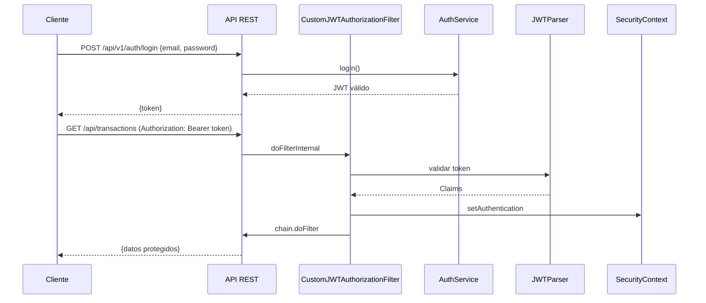

# Capa de seguridad y autenticación JWT – Configuración de seguridad HTTP

Esta sección explica cómo Spring Security se configura para proteger la API REST mediante JWT. La clase `CustomWebSecurity` define los límites de seguridad, los endpoints públicos y el filtro que valida los tokens JWT.

---

## Configuración central: CustomWebSecurity 🎛️

La clase `CustomWebSecurity` orquesta la seguridad HTTP:

```java
@Configuration
@EnableWebSecurity
@EnableMethodSecurity(prePostEnabled = true)
public class CustomWebSecurity {

    @Bean
    SecurityFilterChain configure(HttpSecurity http) throws Exception {
        AuthenticationManagerBuilder amb = http.getSharedObject(AuthenticationManagerBuilder.class);
        amb.inMemoryAuthentication();
        AuthenticationManager authManager = amb.build();

        http
          .sessionManagement()
            .sessionCreationPolicy(SessionCreationPolicy.STATELESS)
          .and()
          .cors()
          .and()
          .csrf().disable()
          .authorizeHttpRequests()
            .requestMatchers(LOGIN_URL, ACTUATOR_URL, API_DOCS).permitAll()
            .anyRequest().authenticated()
          .and()
          .addFilter(new CustomJWTAuthorizationFilter(authManager))
          .authenticationManager(authManager);

        http.headers().frameOptions().disable();
        return http.build();
    }

    @Bean
    CorsConfigurationSource corsConfigurationSource() {
        CorsConfiguration cfg = new CorsConfiguration();
        cfg.setAllowedMethods(Arrays.asList("GET","PUT","POST","DELETE","OPTIONS","HEAD"));
        cfg.addAllowedHeader("*");
        cfg.addAllowedOrigin("*");

        UrlBasedCorsConfigurationSource src = new UrlBasedCorsConfigurationSource();
        src.registerCorsConfiguration("/**", cfg);
        return src;
    }
}
```

- Define sesión **stateless** (sin estado) para cada petición.
- Activa CORS y deshabilita CSRF.
- Permite acceso público a rutas de login, actuator y docs Swagger.
- Requiere JWT válido para `/api/**`.
- Registra `CustomJWTAuthorizationFilter` en la cadena de filtros.

---

## Constantes de seguridad 🔒

La clase `CustomSecurityConstants` agrupa URLs y claves usadas en la capa de seguridad:

| Constante | Valor | Descripción |
| --- | --- | --- |
| LOGIN_URL | `/api/v1/auth/login` | Endpoint para autenticación (Login) |
| ACTUATOR_URL | `/actuator/*` | Rutas de Spring Actuator |
| API_DOCS | `/v3/api-docs/**` | Swagger/OpenAPI JSON |
| SWAGGER_UI | `/swagger-ui/**` | Interfaz Swagger UI |
| HEADER_AUTHORIZATION_KEY | `Authorization` | Nombre del header que contiene el token |
| TOKEN_BEARER_PREFIX | `Bearer ` | Prefijo obligatorio en el header de token |
| SUPER_SECRET_KEY | `...longBase64Key...` | Clave secreta para firmar/verificar JWT |
| TOKEN_EXPIRATION_TIME | `864_000_000` (10 días) | Duración de validez del token |
| ISSUER_INFO | `https://pablito-portfolio.netlify.app` | Información de issuer del JWT |


Mantener la **SUPER_SECRET_KEY** segura y fuera de repositorios públicos.

---

## Filtro de autorización: CustomJWTAuthorizationFilter 🛡️

Intercepta cada petición HTTP, extrae y valida el JWT. Si el token es válido, inyecta la autenticación en el contexto de seguridad:

```java
public class CustomJWTAuthorizationFilter extends BasicAuthenticationFilter {
    @Override
    protected void doFilterInternal(HttpServletRequest req, HttpServletResponse res, FilterChain chain)
            throws IOException, ServletException {
        String header = req.getHeader(HEADER_AUTHORIZATION_KEY);
        if (header == null || !header.startsWith(TOKEN_BEARER_PREFIX)) {
            chain.doFilter(req, res);
            return;
        }
        UsernamePasswordAuthenticationToken auth = getAuthentication(req);
        SecurityContextHolder.getContext().setAuthentication(auth);
        chain.doFilter(req, res);
    }

    private UsernamePasswordAuthenticationToken getAuthentication(HttpServletRequest request) {
        String token = request.getHeader(HEADER_AUTHORIZATION_KEY);
        if (token != null) {
            SecretKey key = Keys.hmacShaKeyFor(Decoders.BASE64.decode(SUPER_SECRET_KEY));
            Jws<Claims> claims = Jwts.parserBuilder()
                .setSigningKey(key)
                .build()
                .parseClaimsJws(token.replace(TOKEN_BEARER_PREFIX, ""));
            return new UsernamePasswordAuthenticationToken(claims.getBody(), null, new ArrayList<>());
        }
        return null;
    }
}
```

- Verifica presencia de header `Authorization`.
- Decodifica y valida firma usando `SUPER_SECRET_KEY`.
- Asigna `Authentication` al contexto de seguridad.

---

## Diagrama de flujo de autorización HTTP



---

## Rutas públicas vs protegidas

| Tipo | Rutas |
| --- | --- |
| Públicas | `/api/v1/auth/login`, `/actuator/*`, `/v3/api-docs/**`, `/swagger-ui/**` |
| Protegidas | Todas las demás bajo `/api/**` requieren JWT |


---

## Dependencias y relaciones

- `**CustomWebSecurity**` importa constantes de `CustomSecurityConstants`.
- Registra `**CustomJWTAuthorizationFilter**`, que depende de `io.jsonwebtoken` y claves de `CustomSecurityConstants`.
- El `**AuthenticationManager**` es inyectado en el filtro para comprobar el flujo de autenticación.
- Otros componentes, como `Utilities.getAuthenticatedUser()`, usan el contexto de seguridad poblado por el filtro.

---

```card
{
    "title": "Seguridad JWT",
    "content": "Protege todos los endpoints con JWT y mant\u00e9n la clave secreta fuera de repositorios p\u00fablicos."
}
```

Este diseño en capas garantiza una API REST segura, escalable y mantenible, con límites claros de qué rutas están abiertas y cuáles exigen un token JWT válido.