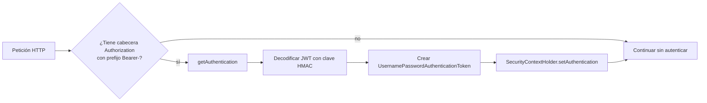

# Capa de seguridad y autenticación JWT

La **Capa de Seguridad** garantiza que solo usuarios con un token JWT válido accedan a los recursos protegidos. Aquí describimos el **Filtro de autorización JWT**, responsable de extraer, validar y establecer la identidad del usuario en cada petición.

---

## Propósito

- Verificar la presencia de un token JWT en la cabecera `Authorization`.
- Decodificar y validar la firma HMAC usando la clave secreta.
- Construir un objeto de autenticación para Spring Security.
- Inyectar la identidad en el contexto de seguridad.

---

## Flujo de filtrado



---

## Constantes clave 🔑

| Constante | Descripción |
| --- | --- |
| HEADER_AUTHORIZATION_KEY | Nombre de la cabecera HTTP que porta el token. |
| TOKEN_BEARER_PREFIX | Prefijo requerido: `"Bearer "`. |
| SUPER_SECRET_KEY | Clave Base64 para firmar y verificar el JWT. |


Estas constantes se definen en `CustomSecurityConstants` .

---

## Clase CustomJWTAuthorizationFilter

Extiende `BasicAuthenticationFilter` y sobrescribe `doFilterInternal`.

```java
public class CustomJWTAuthorizationFilter extends BasicAuthenticationFilter {
    public CustomJWTAuthorizationFilter(AuthenticationManager authManager) {
        super(authManager);
    }

    @Override
    protected void doFilterInternal(HttpServletRequest req,
                                    HttpServletResponse res,
                                    FilterChain chain)
            throws IOException, ServletException {
        String header = req.getHeader(HEADER_AUTHORIZATION_KEY);
        if (header == null || !header.startsWith(TOKEN_BEARER_PREFIX)) {
            chain.doFilter(req, res);
            return;
        }
        UsernamePasswordAuthenticationToken authentication = getAuthentication(req);
        SecurityContextHolder.getContext().setAuthentication(authentication);
        chain.doFilter(req, res);
    }

    private UsernamePasswordAuthenticationToken getAuthentication(HttpServletRequest request) {
        String token = request.getHeader(HEADER_AUTHORIZATION_KEY);
        if (token != null) {
            SecretKey key = Keys.hmacShaKeyFor(
                Decoders.BASE64.decode(SUPER_SECRET_KEY)
            );
            Jws<Claims> claims = Jwts.parserBuilder()
                .setSigningKey(key)
                .build()
                .parseClaimsJws(token.replace(TOKEN_BEARER_PREFIX, ""));
            return new UsernamePasswordAuthenticationToken(
                claims.getBody(), null, new ArrayList<>()
            );
        }
        return null;
    }
}
```

Este filtro extrae el JWT, lo valida y crea un `UsernamePasswordAuthenticationToken` con los *claims* como principal .

---

## Registro en la cadena de filtros

El filtro se integra en **Spring Security** mediante la configuración:

```java
@Configuration
@EnableWebSecurity
@EnableMethodSecurity(prePostEnabled = true)
public class CustomWebSecurity {
    @Bean
    SecurityFilterChain configure(HttpSecurity http) throws Exception {
        AuthenticationManagerBuilder amb = http.getSharedObject(AuthenticationManagerBuilder.class);
        amb.inMemoryAuthentication();
        AuthenticationManager authManager = amb.build();

        http
            .sessionManagement()
                .sessionCreationPolicy(SessionCreationPolicy.STATELESS)
            .and()
            .cors().and().csrf().disable()
            .authorizeHttpRequests()
                .requestMatchers(LOGIN_URL, ACTUATOR_URL, API_DOCS).permitAll()
                .anyRequest().authenticated()
            .and()
            .addFilter(new CustomJWTAuthorizationFilter(authManager))
            .authenticationManager(authManager)
            .headers().frameOptions().disable();

        return http.build();
    }
    // ...
}
```

Aquí se inyecta el **CustomJWTAuthorizationFilter** tras la configuración stateless .

---

## Integración con SecurityContext

- El filtro invoca `SecurityContextHolder.getContext().setAuthentication(…)`.
- A partir de ese punto, `SecurityContextHolder` aporta la identidad en controladores y servicios.
- Utilidades como `Utilities.getAuthenticatedUser()` recuperan el email o usuario de los *claims*.

---

## Relación con otros componentes

- **CustomSecurityConstants**: centraliza rutas públicas y paremetros de JWT.
- **CustomWebSecurity**: configura la política de sesión y registra el filtro.
- **AuthServiceImpl**: genera y firma el JWT al hacer `login`.
- **Utilities**: lee el usuario autenticado del contexto.

---

```card
{
    "title": "Manejo de errores",
    "content": "Un JWT expirado o malformado lanza excepci\u00f3n durante el parseo. Asegure un controlador global de errores."
}
```