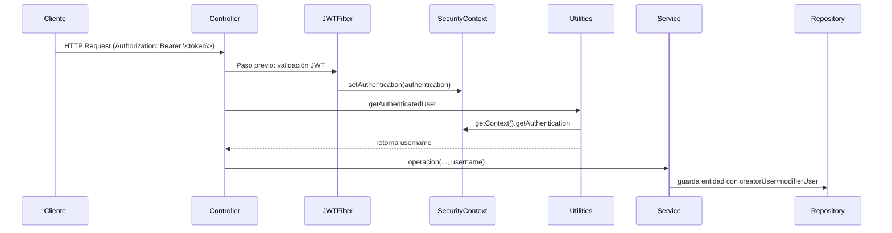

# Capa de Seguridad y Autenticación JWT – Utilidad de Usuario Autenticado 🛠️

Esta sección describe la **clase utilitaria** que conecta el contexto de autenticación JWT con la **auditoría** de las entidades de negocio. A través de un método estático, permite a los controladores recuperar la identidad del usuario autenticado y pasarlo a los servicios para llenar los campos `creatorUser` y `modifierUser`.

## Clase Utilities

La clase `Utilities` provee métodos compartidos para toda la aplicación.

Su responsabilidad en la capa de seguridad es extraer el nombre de usuario autenticado desde Spring Security.

```java
package com.finance.tracker.utility;

import org.springframework.security.authentication.UsernamePasswordAuthenticationToken;
import org.springframework.security.core.context.SecurityContextHolder;

public class Utilities {
    private Utilities() {
        throw new IllegalStateException("Utility class");
    }

    /**
     * Recupera el nombre de usuario autenticado actualmente
     * a partir del SecurityContext.
     *
     * @return username del principal
     */
    public static String getAuthenticatedUser() {
        UsernamePasswordAuthenticationToken auth =
            (UsernamePasswordAuthenticationToken)
            SecurityContextHolder.getContext().getAuthentication();
        return auth.getPrincipal().toString();
    }
}
```

- **Privado** constructor para evitar instanciación.
- **Método estático** `getAuthenticatedUser()` que devuelve el `principal` como cadena.

### Resumen de Métodos

| Método | Descripción |
| --- | --- |
| `getAuthenticatedUser()` | Obtiene el nombre del usuario autenticado desde el SecurityContext. |


---

## Uso en Controladores

Los controladores REST invocan `Utilities.getAuthenticatedUser()` para obtener el usuario y pasarlo a los métodos de servicio. Así se integra la autenticación JWT con la auditoría de datos.

### Ejemplo: TransactionTypeRestController

```java
@RestController
@RequestMapping("/api/v1/transactionType")
public class TransactionTypeRestController {

    @Autowired
    private TransactionTypeService transactionTypeService;

    @PostMapping("/create")
    public ResponseEntity<?> create(@RequestBody TransactionTypeDTO dto) 
            throws NotFoundException {
        String user = Utilities.getAuthenticatedUser();
        transactionTypeService.createTransactionType(dto, user);
        return ResponseEntity.ok().build();
    }

    @PutMapping("/update")
    public ResponseEntity<?> update(@RequestBody TransactionTypeDTO dto) 
            throws NotFoundException {
        String user = Utilities.getAuthenticatedUser();
        transactionTypeService.updateTransactionType(dto, user);
        return ResponseEntity.ok().build();
    }

    @DeleteMapping("/{id}")
    public ResponseEntity<?> delete(@PathVariable Integer id) 
            throws NotFoundException {
        String user = Utilities.getAuthenticatedUser();
        transactionTypeService.deleteTransactionType(id, user);
        return ResponseEntity.ok().build();
    }
}
```

- Cada endpoint **consulta** el usuario autenticado.
- El valor se pasa al servicio como **creatorUser** o **modifierUser**.

---

## Flujo de Integración JWT → Auditoría



- **Cliente** envía token JWT.
- **Filtro de seguridad** decodifica y guarda la autenticación.
- **Utilities** extrae el username del `SecurityContext`.
- **Servicio** persiste la entidad incluyendo los campos de auditoría.

---

## Relación con Entidades y Servicios

| Capa | Responsabilidad |
| --- | --- |
| **Security** | Valida JWT e inserta `Authentication` en el contexto. |
| **Utility** | Expone `getAuthenticatedUser()` para recuperar el usuario actual. |
| **Controller** | Llama al método estático y pasa valor a servicios. |
| **Service** | Recibe `creatorUser` / `modifierUser` y lo asigna en la entidad antes de guardar. |


---

## Buenas Prácticas

- **Centralización**: usar siempre el mismo método para acceder al usuario.
- **Inmutabilidad**: el método es estático y **no** mantiene estado.
- **Auditoría**: garantiza que todas las operaciones de creación/actualización registren el usuario correcto.
- **Seguridad**: si el contexto no contiene autenticación, `getAuthenticatedUser()` puede lanzar `ClassCastException`; manejar este caso si es necesario en controladores o filtros.

---

> La **Utilidad de Usuario Autenticado** es el nexo que conecta la autenticación JWT con la **auditoría** de negocio, asegurando trazabilidad de quién creó o modificó cada recurso.