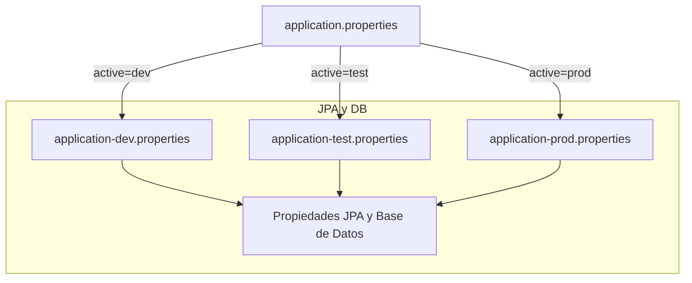

## Configuración de entornos 📦

Cada ambiente (desarrollo, test, producción) carga un conjunto distinto de propiedades según el perfil activo. Spring Boot resuelve primero `application.properties` y luego sobreescribe con `application-<perfil>.properties`.

```properties
# application.properties
spring.profiles.active=dev
```



---

## Propiedades comunes de JPA y PostgreSQL ⚙️

A continuación se resumen las tres propiedades clave usadas en **todos** los perfiles (dev, test, prod) del proyecto :

| Propiedad | Valor | Descripción |
| --- | --- | --- |
| **spring.jpa.hibernate.ddl-auto** | `update` | Sincroniza el esquema con las entidades: crea/ajusta tablas al iniciar la app. |
| **spring.jpa.show-sql** | `true` | Muestra en consola cada instrucción SQL ejecutada por Hibernate. |
| **spring.jpa.properties.hibernate.dialect** | `org.hibernate.dialect.PostgreSQLDialect` | Define el dialecto específico para PostgreSQL, optimiza tipos y sintaxis SQL. |


```properties
# Ejemplo en application-dev.properties
spring.jpa.hibernate.ddl-auto=update
spring.jpa.show-sql=true
spring.jpa.properties.hibernate.dialect=org.hibernate.dialect.PostgreSQLDialect
```

---

## Impacto en cada entorno 🌐

- **Desarrollo (dev)**
- *Migraciones ágiles*: `ddl-auto=update` facilita evolución rápida del modelo.
- *Debugging*: `show-sql=true` ayuda a depurar consultas.
- *Compatibilidad*: el dialecto garantiza tipos `UUID`, `jsonb`, etc.

- **Pruebas (test)**
- Replica configuración de dev para validar lógica de persistencia.
- Ideal para pruebas de integración sin gestionar scripts externos.

- **Producción (prod)**
- **Riesgo de pérdida de datos**: `update` puede alterar o eliminar columnas sin control.
- *Recomendación*: cambiar a `validate` o `none` y usar herramientas de migración (Flyway/Liquibase).

---

## Análisis de rendimiento 📈

El logging de SQL aporta visibilidad, pero implica:

- Mayor **overhead** en I/O de consola o archivos.
- Posible **slowing** en entornos de alta carga.

**Estrategias**:

- Mantener `show-sql=false` en producción.
- Utilizar **log levels** (`DEBUG` para Hibernate) en lugar de `show-sql`.
- Integrar un *profiler* o APM para métricas de consultas.

---

```card
{
    "title": "Advertencia cr\u00edtica",
    "content": "No usar spring.jpa.hibernate.ddl-auto=update en producci\u00f3n; prefiera migraciones controladas."
}
```

```card
{
    "title": "Tip de rendimiento",
    "content": "Deshabilite show-sql en prod y use DEBUG en Hibernate para analizar consultas espec\u00edficas."
}
```

---

## Compatibilidad y mejores prácticas 🔒

- **Dialecto**: dejar `PostgreSQLDialect` explícito en dev y test; en prod es opcional pues Hibernate lo detecta automáticamente.
- **Perfiles**: versionar y cifrar credenciales en entornos remotos.
- **Migraciones**: preparar scripts versionados; auditar cambios de esquema.

Con esta configuración, el proyecto equilibra agilidad en desarrollo y control estricto en producción, manteniendo la compatibilidad con PostgreSQL y un logging claro según el entorno.