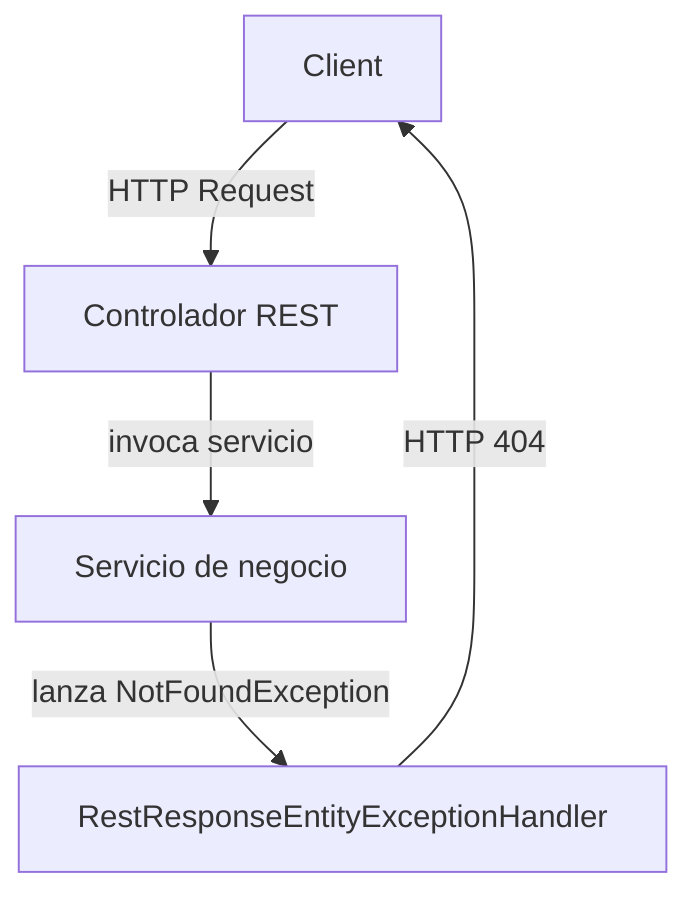

# Manejo de excepciones y errores – Excepciones de dominio ⚠️

En esta sección describimos la excepción **NotFoundException**, su propósito y cómo se integra en la capa de servicios para gestionar validaciones y entidades no encontradas en el dominio de la aplicación.

## ¿Qué es NotFoundException?

Es una excepción *checked* personalizada que extiende de **Exception**. Se utiliza en la lógica de negocio para:

- Señalar **errores de validación** de DTOs.
- Indicar **entidades no encontradas** (usuario, categoría, transacción, etc.).

## Definición de la excepción

```java
package com.finance.tracker.exception;

public class NotFoundException extends Exception {
    public NotFoundException(String message) {
        super(message);
    }
}
```

La clase se encuentra en `src/main/java/com/finance/tracker/exception/NotFoundException.java` .

## Propósito en la aplicación

- Unificar el manejo de **errores de dominio**.
- Forzar a los llamadores a **declarar** o **capturar** excepciones críticas.
- Facilitar la conversión a respuestas HTTP coherentes (404, 400).

## Uso en la capa de servicio

Cada servicio de negocio valida datos y busca entidades. Al detectar inconsistencias, lanza `NotFoundException`. A continuación, un resumen:

| Servicio | Método | Casos de excepción más comunes |
| --- | --- | --- |
| **CategoryServiceImpl** | validateCategory | Categoría nula, nombre vacío, descripción vacía |
| updateCategory, deleteCategory | Categoría no encontrada |  |
| **TransactionServiceImpl** | validateTransaction | DTO nulo, importe o fecha nulos, usuario/categoría/tipo nulo |
| create/update/deleteTransaction | Usuario, categoría o tipo de transacción *no hallado* |  |
| **UserServiceImpl** | validate | UserDTO nulo, username/password/email nulos |
| create/update/delete | Usuario existente, id inválido, usuario *no encontrado* |  |
| **TransactionTypeServiceImpl** | validateTransactionType | DTO nulo, nombre o descripción vacíos |
| update/delete | Tipo de transacción *no encontrado* |  |
| **AuthServiceImpl** | login | Credenciales inválidas, userDTO nulo |


## Manejo centralizado de excepciones 🔄

Se emplea un **ControllerAdvice** para capturar todas las `NotFoundException` y devolver un JSON con código 404:

```java
@ControllerAdvice
public class RestResponseEntityExceptionHandler extends ResponseEntityExceptionHandler {
    @ExceptionHandler(NotFoundException.class)
    @ResponseStatus(HttpStatus.NOT_FOUND)
    public ResponseEntity<ErrorMessage> localNotFoundException(NotFoundException exception) {
        ErrorMessage message = new ErrorMessage(HttpStatus.NOT_FOUND, exception.getMessage());
        return ResponseEntity.status(HttpStatus.NOT_FOUND).body(message);
    }

    @Override
    protected ResponseEntity<Object> handleMethodArgumentNotValid(
        MethodArgumentNotValidException ex,
        HttpHeaders headers,
        HttpStatusCode status,
        WebRequest request) {
        
        Map<String, Object> errors = new HashMap<>();
        ex.getBindingResult().getFieldErrors().forEach(error ->
            errors.put(error.getField(), error.getDefaultMessage())
        );
        return ResponseEntity.status(HttpStatus.BAD_REQUEST).body(errors);
    }
}
```

Definido en `src/main/java/com/finance/tracker/exception/RestResponseEntityExceptionHandler.java` .

## Flujo de propagación de excepciones



## Buenas prácticas

- **Validar** siempre los DTOs antes de procesar la lógica.
- Utilizar mensajes claros y únicos para cada situación de error.
- Mantener `NotFoundException` como *checked* para obligar a su declaración.
- No sobrecargarla con casos ajenos al dominio (usar otras excepciones para problemas internos).

```card
{
    "title": "Tip de implementaci\u00f3n",
    "content": "Crea m\u00e9todos `validateXxx` en cada servicio para centralizar las validaciones y lanzar NotFoundException."
}
```

```card
{
    "title": "Respuesta consistente",
    "content": "Gracias al ControllerAdvice, todos los 404 comparten el mismo formato JSON de ErrorMessage."
}
```