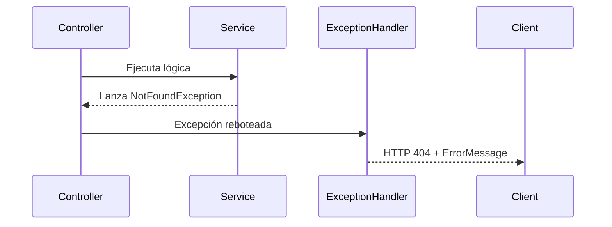

# Manejo de excepciones y errores

El **manejador global de excepciones** centraliza la captura y traducción de errores en respuestas HTTP consistentes. Evita lógica repetida en cada controlador y garantiza que las **excepciones** y **fallos de validación** se expongan con códigos y cuerpos estandarizados.

## Estructura de clases clave

| Clase | Paquete | Descripción |
| --- | --- | --- |
| ErrorMessage | com.finance.tracker.exception | DTO que representa el cuerpo de error con estado y mensaje. |
| NotFoundException | com.finance.tracker.exception | Excepción personalizada para recursos no encontrados. |
| RestResponseEntityExceptionHandler 🛠️ | com.finance.tracker.exception | Captura excepciones y produce respuestas HTTP apropiadas. |


## ErrorMessage

Representa la respuesta JSON cuando ocurre un error.

```java
@Data
@AllArgsConstructor
@NoArgsConstructor
public class ErrorMessage {
    private HttpStatus status;
    private String message;
}
```

- **status**: Código HTTP devuelto.
- **message**: Descripción human-readable del error.

## NotFoundException

Excepción de negocio que indica que un recurso no existe.

```java
package com.finance.tracker.exception;

public class NotFoundException extends Exception {
    public NotFoundException(String message) {
        super(message);
    }
}
```

Se lanza desde la capa *service* cuando no se encuentra una entidad.

## RestResponseEntityExceptionHandler

Clase responsable de interceptar excepciones en todo el contexto de Spring MVC.

```java
@ControllerAdvice
public class RestResponseEntityExceptionHandler extends ResponseEntityExceptionHandler {
    // Manejo de NotFoundException
    @ExceptionHandler(NotFoundException.class)
    @ResponseStatus(HttpStatus.NOT_FOUND)
    public ResponseEntity<ErrorMessage> localNotFoundException(NotFoundException ex) {
        ErrorMessage body = new ErrorMessage(HttpStatus.NOT_FOUND, ex.getMessage());
        return ResponseEntity.status(HttpStatus.NOT_FOUND).body(body);
    }

    // Manejo de validación de argumentos (@Valid)
    @Override
    protected ResponseEntity<Object> handleMethodArgumentNotValid(
        MethodArgumentNotValidException ex,
        HttpHeaders headers,
        HttpStatusCode status,
        WebRequest request
    ) {
        Map<String, String> errors = new HashMap<>();
        ex.getBindingResult().getFieldErrors()
          .forEach(err -> errors.put(err.getField(), err.getDefaultMessage()));
        return ResponseEntity.status(HttpStatus.BAD_REQUEST).body(errors);
    }
}
```

- Se anota con **@ControllerAdvice** para registro automático.
- Hereda de **ResponseEntityExceptionHandler** para extender el manejo de errores de Spring.
- Captura **NotFoundException** y devuelve **404** con cuerpo `ErrorMessage`.
- Sobrescribe **handleMethodArgumentNotValid** para devolver **400** con mapa campo→mensaje.

## Flujo de manejo de excepciones



## Ejemplo de respuesta HTTP

```http
HTTP/1.1 404 Not Found
Content-Type: application/json

{
  "status": "NOT_FOUND",
  "message": "Categoría no encontrada"
}
```

```http
HTTP/1.1 400 Bad Request
Content-Type: application/json

{
  "name": "El nombre no puede estar vacío",
  "description": "La descripción es requerida"
}
```

## Beneficios y buenas prácticas

- **Centralización**: Un único punto de configuración para errores.
- **Consistencia**: Mismas estructuras y códigos en toda la API.
- **Mantenibilidad**: Fácil extensión para nuevos tipos de excepción.
- **Claridad**: Clientes reciben mensajes claros y específicos.

```card
{
    "title": "Tip",
    "content": "Define nuevas excepciones y a\u00f1\u00e1delas al manejador global para ampliar el control de errores."
}
```