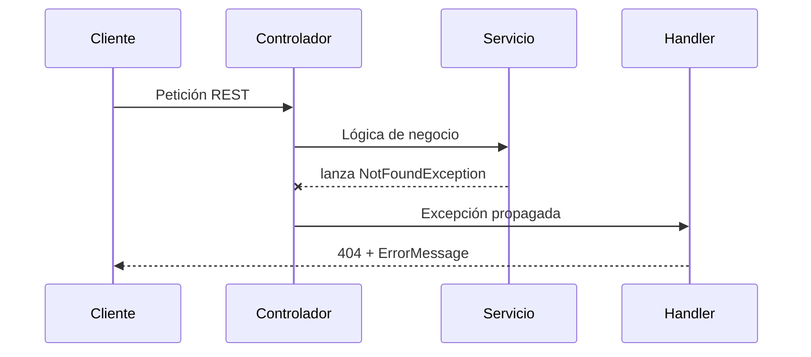

# Manejo de excepciones y errores

En esta sección se detalla el **modelo de error** utilizado por la API para encapsular y estandarizar la información de los errores que ocurren en tiempo de ejecución. El objetivo es ofrecer respuestas coherentes y legibles al cliente, facilitando el diagnóstico y la trazabilidad.

## Modelo de error 🚨

El modelo de error está representado por la clase `ErrorMessage`. Esta clase captura los datos mínimos necesarios para describir un error de forma estructurada.

```java
package com.finance.tracker.exception;

import org.springframework.http.HttpStatus;
import lombok.AllArgsConstructor;
import lombok.Data;
import lombok.NoArgsConstructor;

@Data
@AllArgsConstructor
@NoArgsConstructor
public class ErrorMessage {
    private HttpStatus status;
    private String message;
}
```

### Campos de ErrorMessage

| Campo | Tipo | Descripción |
| --- | --- | --- |
| status | `HttpStatus` | Código HTTP que representa el tipo de error. |
| message | `String` | Mensaje legible con detalles del error. |


## Propósito y beneficios

- **Estandarización**: Unifica el formato de todas las respuestas de error.
- **Claridad**: Proporciona un mensaje entendible y un código HTTP explícito.
- **Facilidad de extensión**: Se pueden añadir nuevos atributos (p.ej. `timestamp`, `details`) sin romper la compatibilidad.

## Integración con el handler global

La clase `RestResponseEntityExceptionHandler` intercepta excepciones lanzadas en cualquier capa (servicio, repositorio, controlador) y las convierte en respuestas HTTP adecuadas.

```java
@ControllerAdvice
public class RestResponseEntityExceptionHandler extends ResponseEntityExceptionHandler {

    @ExceptionHandler(NotFoundException.class)
    @ResponseStatus(HttpStatus.NOT_FOUND)
    public ResponseEntity<ErrorMessage> localNotFoundException(NotFoundException exception) {
        ErrorMessage message = new ErrorMessage(
            HttpStatus.NOT_FOUND,
            exception.getMessage()
        );
        return ResponseEntity
            .status(HttpStatus.NOT_FOUND)
            .body(message);
    }

    @Override
    protected ResponseEntity<Object> handleMethodArgumentNotValid(
        MethodArgumentNotValidException ex,
        HttpHeaders headers,
        HttpStatusCode status,
        WebRequest request
    ) {
        Map<String, Object> errors = new HashMap<>();
        ex.getBindingResult()
          .getFieldErrors()
          .forEach(error -> {
              errors.put(error.getField(), error.getDefaultMessage());
          });
        return ResponseEntity
            .status(HttpStatus.BAD_REQUEST)
            .body(errors);
    }
}
```

### Flujo de manejo de excepciones



## Ejemplo de respuesta de error

```json
{
  "status": "NOT_FOUND",
  "message": "Categoría no encontrada"
}
```

## Buenas prácticas y consideraciones

```card
{
    "title": "Tip",
    "content": "No expongas trazas de pila (stack trace) al cliente; devuelve solo informaci\u00f3n necesaria."
}
```

> **Descripción** 1. El **servicio** detecta una condición inválida y lanza `NotFoundException`. 2. El **handler global** captura la excepción y crea un objeto `ErrorMessage`. 3. Se retorna un `ResponseEntity<ErrorMessage>` con el código y mensaje apropiados.

- Centraliza todo el **manejo de excepciones** en un único `@ControllerAdvice`.
- Utiliza **excepciones personalizadas** (`NotFoundException`, `BadRequestException`, etc.) para mapear distintos escenarios.
- Extiende `ErrorMessage` con nuevos atributos (p.ej. `timestamp`, `path`) según necesidades futuras.
- Valida siempre las entradas y captura errores de validación con `handleMethodArgumentNotValid`.

---

Con este modelo y handler global, la API de **Finance Tracker** garantiza respuestas de error consistentes y fáciles de interpretar, facilitando la interacción con clientes y la depuración de incidencias.